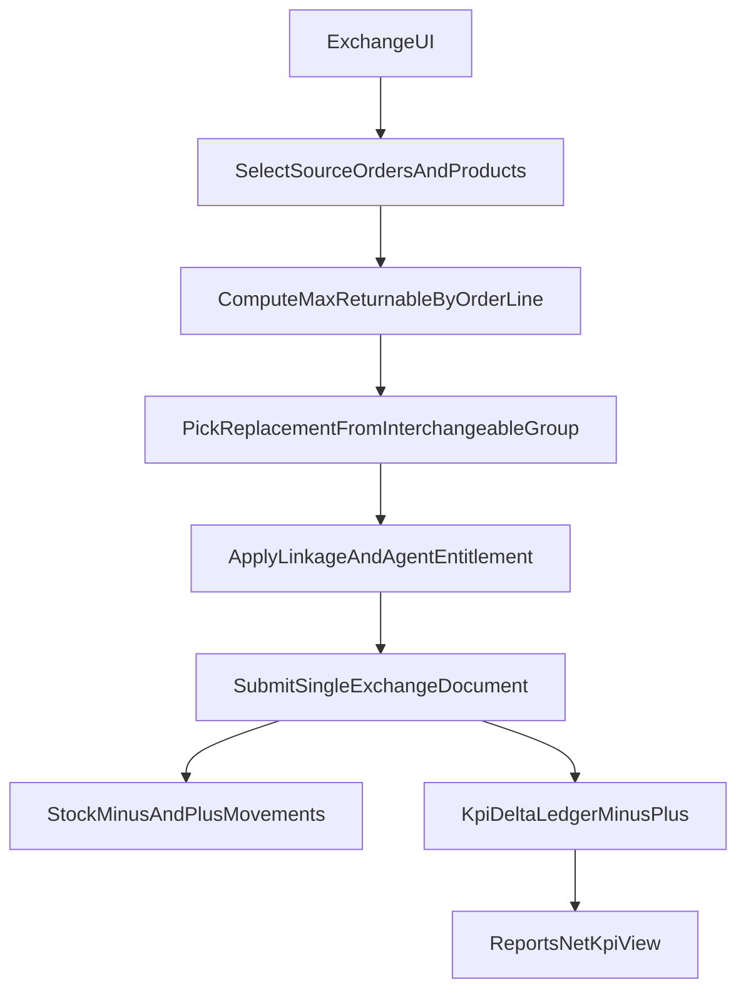

# Linked Exchange Flow Plan

## Maqsad
`/orders/new?type=exchange` oqimini to‘liq biznes-qoidaga moslash:
- bitta hujjatda kamayuvchi (`-`) va qo‘shiluvchi (`+`) qatorlar;
- oldingi zakazga majburiy bog‘lash;
- yangi mahsulotlar faqat `Группа взаимозаменяемых` ichidan;
- agent-linkage/ruxsatdan tashqaridagi mahsulot ko‘rinmasligi;
- KPI/otchyotda netto fakt (`minus` va `plus`) aniq chiqishi.

## Joriy holatdan foydalaniladigan tayanchlar
- Obmen entrypoint va create UI: [frontend/app/(dashboard)/orders/new/page.tsx](e:/SALEC/frontend/app/(dashboard)/orders/new/page.tsx), [frontend/components/orders/order-create-workspace.tsx](e:/SALEC/frontend/components/orders/order-create-workspace.tsx)
- Zakaz create/list/status servislar: [backend/src/modules/orders/orders.route.ts](e:/SALEC/backend/src/modules/orders/orders.route.ts), [backend/src/modules/orders/orders.service.ts](e:/SALEC/backend/src/modules/orders/orders.service.ts), [backend/src/modules/orders/order-status.ts](e:/SALEC/backend/src/modules/orders/order-status.ts)
- Return/order-link max-check tayanchi: [backend/src/modules/returns/returns-enhanced.service.ts](e:/SALEC/backend/src/modules/returns/returns-enhanced.service.ts)
- Linkage scope: [backend/src/modules/linkage/linkage.service.ts](e:/SALEC/backend/src/modules/linkage/linkage.service.ts)
- Interchangeable CRUD: [frontend/components/products/catalog-interchangeable-tab.tsx](e:/SALEC/frontend/components/products/catalog-interchangeable-tab.tsx), [backend/src/modules/products/product-catalog.route.ts](e:/SALEC/backend/src/modules/products/product-catalog.route.ts), [backend/src/modules/products/product-catalog.service.ts](e:/SALEC/backend/src/modules/products/product-catalog.service.ts)

## Arxitektura oqimi

## Ish rejasi

### 1) Data model va API contract
- Exchange hujjat body’sini kengaytirish (`order_type=exchange` uchun):
  - `source_order_ids[]` (majburiy),
  - `minus_lines[]` (`order_id`, `product_id`, `qty`),
  - `plus_lines[]` (`product_id`, `qty`),
  - optional `reason_ref/comment`.
- Zakazga bog‘langan audit JSON maydonida source+delta ni saqlash (yangilash tarixini yo‘qotmaslik uchun).
- `exchange` uchun alohida server validation branch qo‘shish (`createOrder` ichida).

### 2) Source-order asosida maksimal ruxsat etilgan miqdor hisoblash
- `returns-enhanced`dagi mavjud sold-minus-returned hisoblash tamoyilini reuse qilib, exchange uchun helper chiqarish.
- Har `minus_line` bo‘yicha qat’iy tekshiruv:
  - faqat tanlangan `source_order_ids` ichidan;
  - `qty <= max_returnable`.
- Multi-order holatda bir mahsulot bo‘yicha umumiy limitni order-line kesimida kesib yozish.

### 3) Interchangeable group orqali plus mahsulot cheklovi
- `minus_line.product_id` uchun allowed replacement list’ni `interchangeable_group_products`dan olish.
- `plus_lines` faqat shu allowed list ichidan bo‘lishini serverda tekshirish.
- Group topilmasa exchange submitni bloklash (aniq xatolik bilan).

### 4) Linkage/ruxsatni write-time’da ham majburlash
- Hozir create-contextdagi ko‘rinish cheklovlari bor; submit-time’da ham tekshiruv qo‘shish:
  - `selected_agent_id` scope product cheklovi,
  - agent entitlements (`agent_entitlements.product_rules`) bo‘yicha product gate.
- Qoida: ruxsatda yo‘q mahsulot `plus_lines`ga tushsa 400/403 qaytishi.

### 5) Frontend exchange UX (yangi oqim)
- `order-create-workspace`da `exchange` uchun maxsus panel:
  - Agent, davr, source orderlar, source mahsulotlar tanlovi;
  - source tanlov asosida `max` ko‘rsatkichlari;
  - plus mahsulot dropdown faqat interchangeable allowed list;
  - kamayuvchi/qo‘shiluvchi qatorlar bir hujjatda.
- Existing polki/order pick componentlardan reusable qismlarni ajratib ishlatish.

### 6) KPI/report netto ko‘rinishi
- KPI hisoblashga exchange delta’ni aniq qo‘shish:
  - eski KPI mahsulotlar bo‘yicha `-qty`;
  - yangi KPI mahsulotlar bo‘yicha `+qty`.
- Agent KPI reportga 4 kesim qo‘shish:
  - `sales_qty`, `exchange_minus_qty`, `exchange_plus_qty`, `net_qty`.
- Manipulyatsiya signal flaglari:
  - plan to‘lgandan keyingi yuqori exchange ulushi,
  - qisqa muddatda katta minus/plus aylanish.

### 7) “Группа взаимозаменяемых” modulini production-ready qilish
- UI’da delete/deactivate flowni to‘liq yakunlash.
- Backendda `price_types` validatsiyasini tenant price-type reference bilan mustahkamlash.
- Kod uzunligi va validatsiya qoidalarini FE/BE’da birxillashtirish.
- Exchange oqimi uchun lookup endpoint (yoki create-context enrich) qo‘shish.

### 8) Test va rollout
- Backend integration testlar:
  - valid exchange single-doc;
  - over-limit minus reject;
  - non-interchangeable plus reject;
  - linkage/agent-entitlement reject.
- Frontend e2e:
  - source order pick -> max auto-fill -> allowed plus pick -> submit success.
- Bir martalik seed script update:
  - exchange dataset (`minus/plus`) KPI report coverage bilan.
- Rollout: feature-flag + pilot tenant + report verification checklist.

## Qabul mezonlari (Done criteria)
- Exchange hujjati source orderga bog‘lanmasdan yuborilmaydi.
- `plus_lines` faqat interchangeable group ichidan o‘tadi.
- Submit-time’da linkage/ruxsat buzilishi bloklanadi.
- KPI reportda `minus/plus/net` alohida va to‘g‘ri chiqadi.
- E2E + integration testlar yashil, seed bilan qayta ishlab tekshirsa bir xil natija beradi.