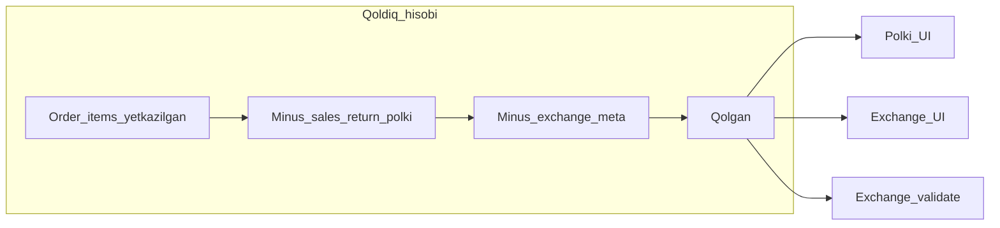

# Zakaz bo‘yicha qoldiq: ketma-ket qaytarish va obmen (yagona mantiq)

## Muammo (reallik)

Misol: zakazda 10 ta, 5 tasi polki orqali qaytarilgan; keyin obmen minusida yana 10 ta ko‘rsatilsa yoki server ruxsat bersa — noto‘g‘ri. Kerak: keyingi har qanday jarayon faqat **qoldiq** ustidan: iqtisodiy jihatdan klientda hali «sotuv bilan bog‘langan» va obmen/polki uchun mavjud dona.

## Hozirgi holat (kod bo‘yicha)

- **Server — obmen minus limiti**: [`validateExchangeMinusAgainstSourceOrders`](d:/SALEC/SALEC/backend/src/modules/orders/exchange-source-limits.service.ts) quyidagilarni qiladi:
  1. `getClientReturnsData(..., { shrinkLineQtyAfterReturns: true })` dan kelgan qatorlar (polki qoidasi: [`adjustOrderItemsQtyAfterPriorReturns`](d:/SALEC/SALEC/backend/src/modules/returns/returns-enhanced.service.ts) orqali `sales_return` dan keyin qoldiq).
  2. [`sumPriorExchangeMinusByOrderLine`](d:/SALEC/SALEC/backend/src/modules/orders/exchange-source-limits.service.ts) — `exchange` zakazlarining `exchange_meta.minus_lines` bo‘yicha allaqachon «minus» qilingan donalar.
  3. Har `(order_id, product_id)` uchun `qolgan = shrunk − prior_minus`, so‘rov `req` bilan solishtiriladi; oshsa `EXCHANGE_MINUS_OVER_LIMIT`.

- **P0 xato (bir nechta manba zakaz)**: shu faylda chaqiruv:

```73:75:d:/SALEC/SALEC/backend/src/modules/orders/exchange-source-limits.service.ts
  const cr = await getClientReturnsData(tenantId, clientId, undefined, undefined, uniqueOrders, {
    shrinkLineQtyAfterReturns: true
  });
```

[`getClientReturnsData`](d:/SALEC/SALEC/backend/src/modules/returns/returns-enhanced.service.ts) imzosi: `(…, orderId?, orderIds?, opts?)`. Hozir `uniqueOrders` **5-o‘rin**da (`orderId` o‘rniga), `opts` esa **6-o‘rin**da (`orderIds` o‘rniga) tushadi — TypeScript ham bu yerda noto‘g‘ri tip (`number[]` → `orderId`) bilan bog‘langan bo‘lishi mumkin. Runtime’da **ikki va undan ortiq** `source_order_ids` bo‘lsa, `resolvedOrderIds` bo‘sh yoki noto‘g‘ri tushib, **butun mijoz davri** rejimiga o‘tish xavfi bor (noto‘g‘ri limit).

**Reja bosqichi 0 (majburiy)**: chaqiruvni to‘g‘rilash:

`getClientReturnsData(tenantId, clientId, undefined, undefined, undefined, uniqueOrders, { shrinkLineQtyAfterReturns: true })`

va `tsc` / integratsiya testi: `source_order_ids` = 2 ta zakaz bilan obmen minus tekshiruvi.



## Bo‘shliqlar (UI va API)

| Joy | Hozir | Kerak |
|-----|--------|--------|
| [Exchange panel](d:/SALEC/SALEC/frontend/components/orders/exchange-order-create-panel.tsx) `buildExchangePairRows` / `row.max` | `client-data` qatorlari (polki shrink) | **Obmen minusidan keyingi qoldiq** bilan bir xil (server formulasi) |
| `returns/client-data` | Faqat polki shrink | Ixtiyoriy `?for_exchange=1` yoki alohida `GET .../exchange/source-availability` — har `(order_id, product_id)` uchun `max_minus_qty`, `already_returned`, `already_exchange_minus` (shaffoflik) |
| [`valueForMinusFromSourceOrder`](d:/SALEC/SALEC/backend/src/modules/orders/exchange-order-create.ts) | `order_items` dan olish | `validate` dan keyin chaqiriladi — limit to‘g‘ri bo‘lsa, miqdor jihatdan mos; lekin **audit**: manba zakaz qatorlari DB’da kamaytirilmagan bo‘lsa, kelajakda chalkashlik — hujjatlar bilan «virtual qoldiq» manbai yagona bo‘lishi ma’qul |

## Boshqa variantlar (tahlil ro‘yxati)

1. **Polki** ([`createPeriodReturn` / batch](d:/SALEC/SALEC/backend/src/modules/returns/returns-enhanced.service.ts)) — allaqachon buyurtma + `sales_return` bo‘yicha miqdor tekshiruvi; obmen minus **sales_return emas**, shuning uchun obmen limiti alohida `exchange_meta` orqali (hozirgi kabi).
2. **To‘liq zakaz qaytarishi** — `order.items` to‘liq qamrov; avvalgi polki bilan to‘qnashuv `createFullReturnFromOrder` ichidagi oldingi returnlar bilan hisobda — alohida tekshirish (allaqachon qisman bor).
3. **Bekor qilingan obmen** — `sumPriorExchangeMinusByOrderLine` `status: { not: "cancelled" }`; [`updateOrderStatus`](d:/SALEC/SALEC/backend/src/modules/orders/orders.service.ts) obmen bekorida minus/plus/stock qaytarilishi bilan **qoldiq qayta ochiladimi** — tekshiruv ro‘yxatiga qo‘shish.
4. **Bir nechta zakazdan bir vaqtda polki** (`getClientReturnsDataMultipleOrders`) — shrink bor; lekin obmen UI ko‘pincha `order_ids` bilan GET — server tomonda P0 tuzatilgach, multi-source bilan bir xil ma’lumot oqimi.
5. **Zakaz turi `partial_return` / `return` / qator tahriri** — agar manba zakaz `order_items` ni kamaytiradigan alohida yo‘l bo‘lsa, **yagona qoldiq** manbai sifatida faqat DB qatorlari emas, balki yuqoridagi formula (yoki bitta `getOrderCommercialRemaining`-service) kerak bo‘lishi mumkin — kod bo‘yicha `grep` va holatga qarab kengaytirish.

## Tavsiya etilgan arxitektura (qisqa)

- **Yagona funksiya** (masalan `computeDeliveredRemainingByOrderProduct(tenantId, clientId, orderIds, opts)`): chiqish — `Map<orderId:productId, { qty, paid, bonus, caps... }>`; ichida:
  - `getClientReturnsData` shrink natijasi (yoki ichki helperni ajratish);
  - `sumPriorExchangeMinusByOrderLine` (ixtiyoriy `excludeOrderId` yangi obmen uchun).
- `validateExchangeMinusAgainstSourceOrders` shu map ustida qoladi (yoki ichki chaqiruv).
- **GET** (UI): shu map’dan `max_minus` + tushuntirish maydonlari.

## Frontend

- Exchange: `returnsQ` ma’lumotini yagona endpointdan olish; `buildExchangePairRows` da `max` = server `max_minus` yoki clientda `shrunk_qty - prior_exchange` (server bilan bir xil tartib).
- Xato matnlari: `EXCHANGE_MINUS_OVER_LIMIT` uchun `max_qty` allaqachon beriladi — [`orders.route.ts`](d:/SALEC/SALEC/backend/src/modules/orders/orders.route.ts) mapping va foydalanuvchi tili.

## Testlar (minimal to‘plam)

- P0: `source_order_ids` = `[A,B]`, har ikkala zakazda mahsulot, polki + obmen ssenariylari — limit faqat shu zakazlar yig‘indisi bo‘yicha.
- Bitta zakaz: 10 sotilgan → 5 polki → obmen minus 6 → 400.
- Ikki ketma-ket obmen: birinchi minus 3, ikkinchi minus 3, qoldiq 4 bo‘lsa 4 dan oshiq → 400.
- Bekor obmen: minus «qayta» chiqadimi (integratsiya).

## Rollout

1. P0 tuzatish + test (bir kun).
2. Yagona `remaining` service + GET (UI) + exchange panel (1–2 kun).
3. Qolgan hujjat turlari / cancel / tahrir audit (iteratsiya).
