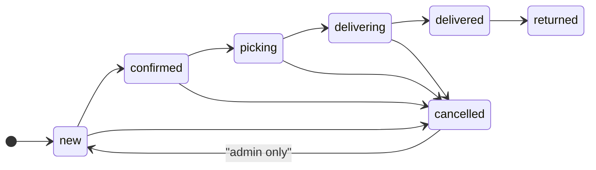

# Buyurtma holatlari va o‘tishlar

Manba: [backend/src/modules/orders/order-status.ts](../backend/src/modules/orders/order-status.ts).

## Holatlar ro‘yxati

`new`, `confirmed`, `picking`, `delivering`, `delivered`, `returned`, `cancelled`

Eski qisqa diagrammada (faqat `new → … → delivered → cancelled`) **ko‘rinmaydigan** qoidalar:

- **`delivered` → `returned`** — oldinga ruxsat (qaytarish jarayoni).
- **Orqaga bir qadam** — `reverseTransitions` (masalan `delivered` → `delivering`), faqat bitta bosqich.
- **`cancelled` → `new`** — faqat **admin** (`orders.service` `FORBIDDEN_REOPEN_CANCELLED`).
- **Operator** `picking` / `delivering` dan to‘g‘ridan-to‘g‘ri `cancelled` ga o‘ta olmaydi (`ORDER_STATUSES_OPERATOR_CANNOT_CANCEL_FROM`).

## Oldinga o‘tishlar (asosiy zanjir)

**Izoh:** `delivered → cancelled` to‘g‘ridan-to‘g‘ri **forward** jadvalda yo‘q; bekor qilish odatda oldingi bosqichlarga qaytish yoki maxsus biznes qoidalari orqali boshqariladi (kodda `delivered` dan `cancelled` forward setda yo‘q).

## Orqaga (bir qadam) — `reverseTransitions`

| From | Ruxsat etilgan to |
|------|-------------------|
| confirmed | new |
| picking | confirmed |
| delivering | picking |
| delivered | delivering |

## Kredit yuki

`cancelled` va `returned` holatidagi buyurtmalar kredit yig‘indisiga kirmaydi: `ORDER_STATUSES_EXCLUDED_FROM_CREDIT_EXPOSURE`.
